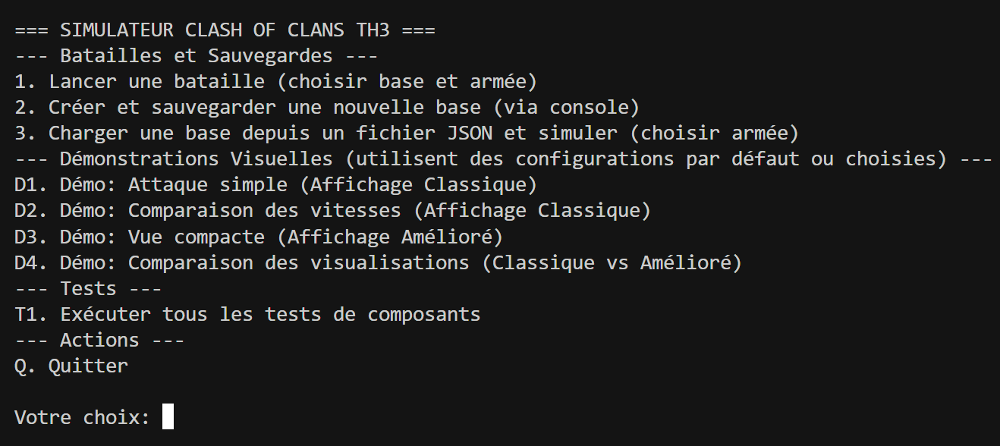
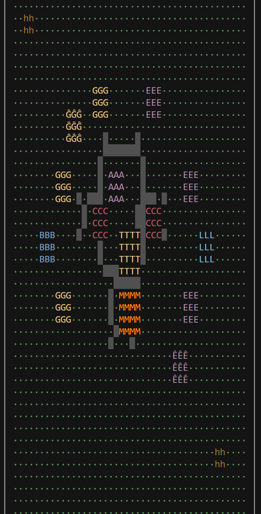
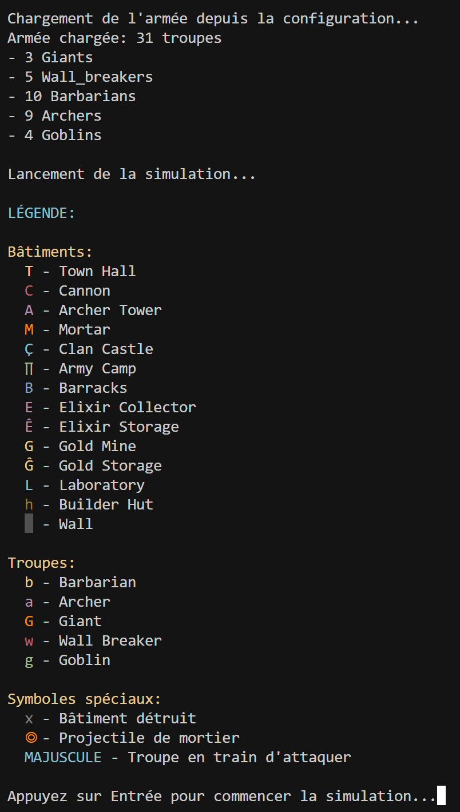
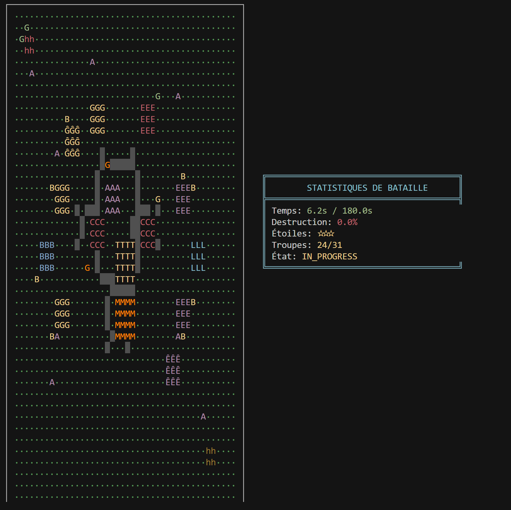
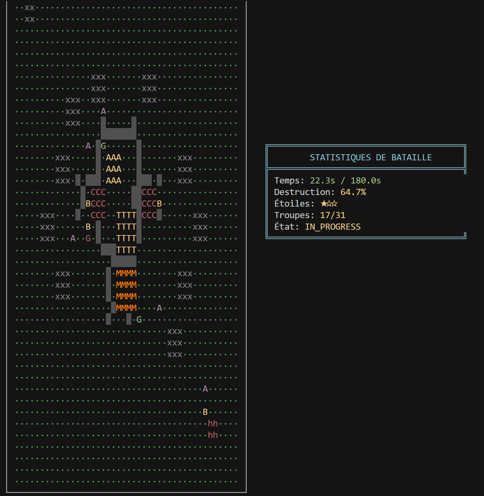
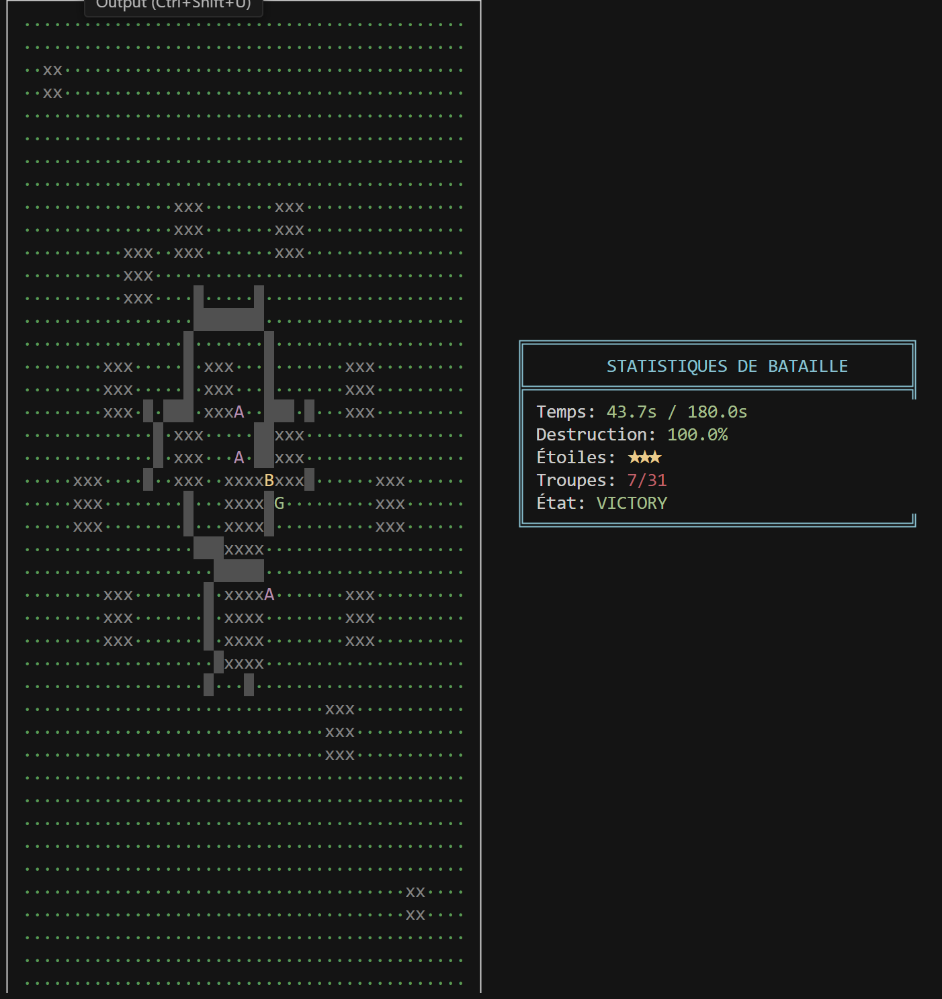
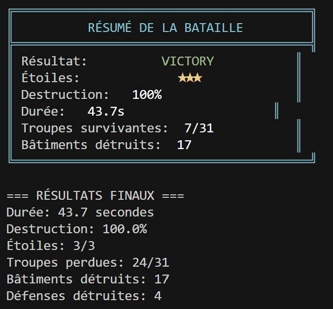

# Clash of Clans AI Battle Simulator

A Python-based battle simulation engine for Clash of Clans, designed to explore attack strategies for Town Hall 3.

## Project Overview

This project aims to develop a complete attack simulator for Clash of Clans. Given a pre-configured base, the project's goal is to intelligently compute a great number of attacks in order to find the way to make the best attack score against that base.
It will be particularly useful for clan wars, where attack planning is possible by analyzing an enemy base beforehand.

The program will also have to account for randomness: hidden traps, castle clan defense troops, and some rare random troop behaviours such as the fact that air troops position themselves randomly on the front of the building they are targeting, making it more difficult to predict where the air troop will go after that target is destroyed. Ideally, the program would find the perfect way to attack a base, as well as an estimate of the percentage of incertitude for that attack (accounting for all randomness). This percentage can be calculated by computing all the different possible outcomes (determined by all possible random events) of a precise attack, and measuring the differences in final destruction percentage between those outcomes.

### Current Status (Alpha - TH3 Prototype)

- Basic battle simulation engine tailored for Town Hall 3.
- Core TH3 troop implementations: Barbarians, Archers, Giants, Wall Breakers, Goblins, each with specific targeting logic.
- Pathfinding using A* algorithm, with troops having varying penalties for attacking walls (e.g., Wall Breakers pass through easily, others prefer to avoid).
- Real-time ASCII visualization in the terminal, with battle statistics displayed side-by-side with the grid.
- Battle logging to files for detailed analysis.
- Configurable base layouts and army compositions via data files.
- Destruction percentage calculation correctly based on destroyed buildings (excluding walls).

## Technical Deep Dive: The Vision for Advanced Strategy Simulation

The following sections outline the original, more ambitious vision for this project, extending beyond the current TH3 prototype.

### The Challenge

Finding the optimal attack strategy in Clash of Clans is a complex combinatorial problem:

- Action Space: For a sophisticated AI, consider ~50 troop types/levels, over 1,000 valid deployment positions, and critical timing, leading to millions of initial possibilities.
- Simulation Requirements: Each strategy evaluation necessitates a full battle simulation. A standard game lasts 180 seconds, which at a typical 60 ticks/second for physics and AI, translates to ~10,800 ticks per simulation.
- Computational Complexity: Per tick, calculations involve pathfinding for each unit, target detection, damage dealing, HP updates, and collision checks. This can amount to ~50,000 operations per tick for a moderately complex battle, leading to ~500-600 million operations per full simulation.

### Our Approach (Conceptual for Advanced AI)

1. High-Performance Simulation Engine
   - Current Prototype: Python-based, achieving a few seconds per full TH3 simulation.
   - Target for Advanced AI: A C++ optimized engine aiming for <0.01 seconds per simulation (potentially 0.1s to 0.4s for complex, full-scale simulations before extreme GPU optimization).
   - Potential Optimization Techniques:
     - Algorithmic: Spatial hashing (e.g., `std::unordered_map<int, std::vector<Entity*>> grid; int hash(float x, float y)`) for O(n) average proximity detection instead of O(n²), efficient A* for pathfinding.
     - Memory: Object pooling (`template<typename T> class ObjectPool {...}`) to minimize dynamic allocations/deallocations.
     - Low-level: SIMD instructions (e.g., `__m256 distances = _mm256_sqrt_ps(...)`) for parallelizing vector calculations like distance computations.
     - Simulation Flow: Early stopping if a 3-star is achieved or if failure is evident (-20-40% time). Simplified simulation ticks (e.g., 10 ticks/sec instead of 60) for rough evaluations (-80% time).
     - Hardware Acceleration: GPU (CUDA/OpenCL) for massively parallel tasks like batched simulations or complex physics, potentially offering 100-1000x speedup on suitable portions of the simulation.

2. Intelligent Search Strategy
   Instead of brute-force, the vision includes:
   - Monte Carlo Tree Search (MCTS) for strategic exploration of the vast action space.
   - Reinforcement Learning (RL) to learn from successful and unsuccessful attack patterns over millions of simulated battles.
   - Heuristic pruning to eliminate obviously suboptimal strategies early in the search process.

3. Optimal Simulation Architecture (Conceptual)
   A hybrid architecture could be employed:
   - Orchestrator: Python (e.g., using `asyncio`) for managing simulation batches, parameters, and results.
   - CPU Workers: Multiple C++ worker processes/threads for computationally intensive single simulations.
   - GPU Worker: Dedicated C++/CUDA worker for tasks suitable for massive parallelism, such as batched mini-simulations or complex visual/physics processing if implemented.

### Scalability & Cost Estimates (Conceptual for Advanced AI)

Based on an estimated ~600M operations per full simulation:

| Implementation              | Est. Time / Sim | Sims / Hour (Single Core) | Sims / Sec (Optimized C++, 32 Cores Est.) | Target Sims / Sec (GPU, e.g., A100) |
|-----------------------------|-----------------|---------------------------|-------------------------------------------|---------------------------------------|
| Python (Prototype, TH3)     | ~1-5s           | ~720 - 3,600              | N/A                                       | N/A                                   |
| Python (NumPy, Full Scale)  | ~5-20s          | ~180 - 720                | N/A                                       | N/A                                   |
| C++ (Optimized, Full Scale) | ~0.1s - 0.4s    | ~9k - 36k                 | ~500 - 600                                | ~50,000 - 1,000,000 (highly parallel) |

AWS Cost Considerations (Illustrative, prices vary):

- Development/Testing (e.g., 1M exploratory simulations):
  - CPU (e.g., `c5.24xlarge`, ~500 C++ sims/sec): Could take ~30-40 minutes, costing a few dollars ($2-3).
  - GPU (e.g., `p3.2xlarge` V100, ~50,000 C++ CUDA sims/sec): Could take ~20 seconds, costing cents ($0.01-$0.02).
- Intensive RL Training (e.g., 100M simulations/day):
  - GPU Spot Instances (e.g., `p3.2xlarge` at ~$0.90/hr): Could cost ~$20-50/day depending on actual throughput and instance availability.
- Production (Serverless, e.g., Lambda + Fargate for C++): Highly dependent on usage, but potentially cost-effective for on-demand simulations.

Recommendation: C++ core for simulation, GPU for mass training, serverless for flexible production deployment. The project, if pursued at scale, is computationally intensive but manageable with cloud resources.

## Architecture (Current TH3 Simulator)

The simulator is organized into several Python modules:

1. `clash_simulator.core.config`:
   - Contains core game constants: grid size, tick rate, max battle duration.
   - Defines statistics for troops and buildings at TH3 levels (HP, damage, speed, range, etc.).
   - Stores TH3 building limits and pathfinding/AI parameters (e.g., wall penalties, retarget intervals).

2. `clash_simulator.entities`:
   - `building.py`: Base `Building` class.
   - `defense_buildings.py`: Defensive structures (`Cannon`, `ArcherTower`, `Mortar`) with attack logic.
   - `other_buildings.py`: Non-defensive structures (`TownHall`, `Wall`, resource buildings, etc.) and `create_building` factory.
   - `troop.py`: Base `Troop` class (state, movement, targeting, attack) and `TroopState` enum.
   - `troop_types.py`: Specific TH3 troops (`Barbarian`, `Archer`, `Giant`, `WallBreaker`, `Goblin`) with unique targeting preferences and `create_troop` factory.

3. `clash_simulator.systems`:
   - `base_layout.py`: Manages the game grid, building placement, base state, and calculates destruction percentage (based on buildings, excluding walls).
   - `battle_simulator.py`: Orchestrates the simulation loop, updates entities, resolves combat, and checks end conditions. Integrates with `BattleLogger`.
   - `pathfinding.py`: Implements the A* pathfinding algorithm, considering terrain and troop-specific wall traversal costs.

4. `clash_simulator.data`:
   - `base_configs.py`: Predefined base layouts and a loader function.
   - `army_configs.py`: Predefined army compositions and a loader function.

5. `clash_simulator.visualization`:
   - `terminal_display.py`: Standard real-time ASCII visualization, now displaying game grid and stats side-by-side.
   - `improved_display.py`: Compact ASCII visualization option.

6. `clash_simulator.utils.logger`:
   - `logger.py`: `BattleLogger` for recording detailed simulation events to log files.

7. `main.py`:
   - Main entry point with an interactive command-line menu to run simulations, demos, and tests.

## Key Algorithms (Current TH3 Simulator)

### Troop Targeting

Troop target selection is a multi-step process:

1. Candidate Identification: Based on troop type (e.g., Giants prioritize defenses), a list of potential target buildings is generated.
2. Proximity Sort: These candidates are sorted by Euclidean distance.
3. Evaluation: A small number of the closest candidates (N, configurable via `PATHFINDING_CONFIG["num_candidates_to_evaluate"]`) are evaluated.
4. Scoring: Each candidate is scored based on a combination of distance and a troop-specific preference score (e.g., Goblins highly prefer resource buildings).
    - Non-Wall Breaker troops assign an infinitely high preference penalty to targeting walls directly, ensuring they focus on actual buildings.
5. Selection: The troop targets the building with the best (lowest) score.
6. Pathfinding: The A* algorithm then calculates the actual path to this chosen target, applying wall penalties as defined below.

### Wall Penalty System & Pathfinding

The A* pathfinding algorithm considers walls based on the attacking troop:

- Barbarians/Archers/Goblins: High wall penalty (e.g., 15.0-20.0). They will attack walls only if it's the most viable path to their building target, preferring to go around.
- Giants: Medium wall penalty (e.g., 10.0). They are more willing to break through walls to reach defenses.
- Wall Breakers: Minimal wall penalty (e.g., 0.1). They effectively "see through" walls when pathing to their chosen building target, allowing them to head straight for walls that obstruct their path. Their primary role is to destroy these walls upon contact.

## Demos








## Installation and Usage

### Installation

1. Ensure Python 3 (3.8+) is installed.
2. Clone this repository.
3. No complex external dependencies beyond standard Python libraries are needed for the core simulator.

### Running the Simulator

1. Navigate to the project's root directory.
2. Execute:

   ```bash
   python clash_simulator/main.py
   ```

### Interactive Menu

The menu allows:

1. Run Full Simulation with Terminal Display:
   - Primary mode to observe battles. Prompts for base and army selection.
   - The first base ("Simple TH3 Par Défaut") and first army ("Armée Mixte TH3 (Main)") are recommended for a comprehensive test.
2. Run Custom Battle (No Visuals, Quick Stats): For fast, non-visual simulations.
3. Run Demo Scenarios: Access various pre-configured demonstrations.
4. Run All Component Tests: Executes tests from `clash_simulator/tests/test_components.py`.
5. Exit.

## Project Structure

```text
clash_simulator/
├── core/
│   ├── __init__.py
│   └── config.py           # Game constants, entity stats, TH limits, AI params
├── data/
│   ├── __init__.py
│   ├── army_configs.py     # Predefined army compositions
│   └── base_configs.py     # Predefined base layouts
├── entities/
│   ├── __init__.py
│   ├── building.py         # Base Building class
│   ├── defense_buildings.py # Cannon, ArcherTower, Mortar, Projectile
│   ├── other_buildings.py  # TownHall, Wall, collectors, etc. + factory
│   ├── troop.py            # Base Troop class, TroopState enum
│   └── troop_types.py      # Barbarian, Archer, Giant, etc. + factory
├── systems/
│   ├── __init__.py
│   ├── base_layout.py      # Manages grid, building placement, base state
│   ├── battle_simulator.py # Core simulation loop, combat logic
│   └── pathfinding.py      # A* pathfinding implementation
├── tests/
│   ├── __init__.py
│   └── test_components.py  # Unit and integration tests
├── utils/
│   ├── __init__.py
│   └── logger.py           # Battle logging utility
├── visualization/
│   ├── __init__.py
│   ├── improved_display.py # Compact visualization
│   └── terminal_display.py # Standard ASCII visualization
├── __init__.py
├── demo_battle.py          # Demo functions (now primarily run via main.py)
├── demo_improved.py        # Demo functions (now primarily run via main.py)
└── main.py                 # Main entry point, interactive menu

logs/
└── battles/                # Directory for saved battle logs (created on first log)

README.md
```

## Roadmap

### Phase 1: Foundation (Current)

- [x] TH3 prototype with core troops and buildings.
- [x] Basic Python simulation engine.
- [x] Terminal-based visualization.
- [x] Battle logging.
- [x] Configurable bases and armies.
- [x] Refined troop targeting and wall interaction.
- [ ] Expanded test coverage for various scenarios.
- [ ] Further refinement of pathfinding edge cases and advanced Wall Breaker AI (e.g., targeting specific compartments).

### Phase 2 & Beyond: Optimization & AI (Future Ideas - Original Vision)

- C++ core rewrite for performance.
- GPU acceleration.
- Reinforcement learning integration.
- Support for higher Town Hall levels.
